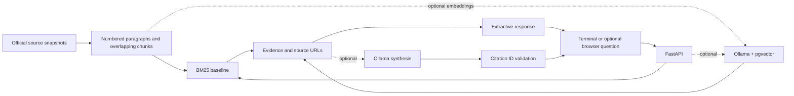

# EU AI Act Evidence Explorer

[](https://github.com/suprkco/rag-eu-ai-act/actions/workflows/ci.yml)
[](https://render.com/deploy?repo=https://github.com/suprkco/rag-eu-ai-act)

**A local retrieval and optional generation prototype with inspectable legislative evidence.**

## Problem

An answer about AI regulation is difficult to review without a path back to its source.
This prototype retrieves passages from 20 selected AI Act and GDPR articles and returns source-owned citations, with an optional local-model synthesis.

## Demo

Run `python -m app.cli` for a terminal session, or ask one question:

```sh
python -m app.cli "What human oversight is required for high-risk AI systems?"
```

Answers include source excerpts, links and snapshot versions. `/quit` exits; questions are independent, not conversational memory. Add `--json` to a one-shot question for scripting. [Recorded terminal output](docs/terminal-demo.txt).

The optional browser client at http://localhost:3000 uses the same plain, monospace presentation. Default retrieval requires no model or API key.

## Architecture



## Tech stack

Python, FastAPI, Pydantic, Next.js, React, TypeScript, BM25, Prometheus, pytest, Playwright, Docker and GitHub Actions. Optional adapters use Ollama, PostgreSQL and pgvector. The PostgreSQL connection can target a dedicated Supabase database.

## Quickstart

With Docker Compose:

```sh
docker compose up --build
```

Open http://localhost:3000; interactive API documentation is at http://localhost:8000/docs. Services bind only to loopback on the host.

For the terminal, use Python 3.10+:

```sh
python -m venv .venv
# Activate .venv for your shell, then:
python -m pip install -r requirements.txt -r requirements-dev.txt
python -m app.cli
```

Optional browser client: start `python -m uvicorn app.main:app --port 8000`, then with Node 24 in another terminal:

```sh
cd web
npm ci
npm run dev
```

The bundled corpus makes the default demo network-independent after dependency installation. To refresh it explicitly: `python -m scripts.ingest`. Review source/version changes and rerun evaluation before committing a refreshed corpus.

### Optional model and vector paths

See [.env.example](.env.example). Set variables in the process environment; the backend does not automatically load `.env`.

For synthesis, run a local Ollama service with `qwen2.5:3b` installed, then run `python -m app.cli --mode ollama`. An alternative llama.cpp backend is selected with `GENERATION_BACKEND=llamacpp` and `--mode model`. The measured Qwen2.5-0.5B pilot produced unsupported answers despite valid citation IDs; see [the challenge evaluation](docs/challenge-evaluation.md). Keep extractive mode as the default.

For vector retrieval, install the `nomic-embed-text` Ollama model, set `DATABASE_URL` for a **dedicated** PostgreSQL database, then run:

```sh
python -m app.vector
# Set RETRIEVER=pgvector before starting the API.
```

Ingestion explicitly creates `legal_chunks` and upserts records; use a limited read-only role for serving queries. For Supabase, enable the vector extension and use a server-side database connection with TLS (`sslmode=require`). Never expose that connection string to the browser. The adapter expects 768-dimensional embeddings; changing models requires rebuilding the corpus in a fresh table/database. Cloud deployment and semantic-retrieval quality remain unvalidated.

### Public deployment

[deploy/Dockerfile](deploy/Dockerfile) builds one container: the web client is exported statically and served by FastAPI on the same origin, so there is no CORS setup and no second service. It runs BM25 only (`ALLOWED_MODES=extractive`): no model, no database and no secret, which keeps a free instance cheap and safe to expose. Generation modes return HTTP 400 there instead of timing out. CI builds and smoke-tests this exact image.

On Render, choose **New > Blueprint** and select this repository; [render.yaml](render.yaml) configures the free Docker service and its `/health` check. The same image runs on Railway or Fly.io, which inject `PORT`. A free Render instance sleeps when idle, so the first request can take about a minute.

For a separate frontend deployment instead, set `NEXT_PUBLIC_API_URL` at build time and `WEB_ORIGINS` on the API.

## Evaluation

**New challenge run, 1 October 2026:** 8/8 relevant-article hits on new answerable questions, but **0/4 retrieval abstentions on near-domain unanswerable questions**. A real local Qwen2.5-0.5B generated all 16 responses with valid schemas and citation IDs, yet invented prices, a deadline and a penalty. [Raw outputs, protocol and failure analysis](docs/challenge-evaluation.md). Citation validity is not answer faithfulness; independent human quality labels and vector-model comparison remain pending.

Recorded locally on 2026-09-29, Python 3.10.4 / Windows, using BM25 without an LLM:

| Measure | Observed result |
| --- | --- |
| Expected article found in top 5 chunks | 20/20 (100%) |
| Mean reciprocal rank at 5 | 0.925 |
| Abstention on unrelated questions | 5/5 |
| Backend tests (updated 1 October) | 22 passed, including observability; pgvector integration requires a dedicated database |
| Browser tests | 2 passed: evidence flow and mobile layout |

These are **development-set results**, not a held-out benchmark, legal accuracy score, or production guarantee. Questions were authored against this small corpus. Five easy negative examples do not establish reliable abstention on difficult near-domain questions. [Per-question results, hashes and environment](evaluation/results.json) are committed.

Reproduce with `python -m scripts.evaluate`, `pytest -q`, and `ruff check .`. Run `npx playwright test` in `web/` with both services running. CI also exercises the pgvector SQL round trip using synthetic embeddings; it does not measure a real embedding model.

## Observability

`/metrics` exposes Prometheus series for the outcome mix (answered, abstained, retrieval or generation error), retrieval confidence, citations returned, model token usage, per-stage latency, and generation failures classified by cause: backend unavailable, invalid schema, citation outside the retrieved evidence, or truncated output. Each response returns a `trace_id` matching one JSON log line with stage timings, retrieved and cited chunk IDs, and a hash of the question instead of its text.

The point is to catch silent drift: a rising abstention rate, a falling median retrieval score or any citation outside the evidence set. [Metrics, PromQL alerts and a debugging runbook](docs/observability.md).

## Design choices

- **Inspectable baseline first.** BM25 makes retrieval behavior reproducible without API costs. It is a baseline, not semantic search.
- **Source boundaries matter.** Numbered legal paragraphs remain together before 220-word windows with 40-word overlap.
- **Evidence owns citations.** Source URLs come from the corpus. Unknown model citation IDs cause a failure, not silent acceptance.
- **Failure is explicit.** No matching chunks produces an abstention; model failures return an error rather than invented prose.
- **Separate measurements.** Retrieval quality, protocol correctness and generated-answer faithfulness are different questions.

An [attributed HKUDS/LightRAG comparison harness](docs/open-source-baseline.md) exports this corpus and measures source-document references from an external LightRAG instance. It is not a copy of the upstream engine, and no live LightRAG performance is claimed.

## Limitations and next steps

The corpus covers only 20 articles in English. The Commission pages are snapshots, and the GDPR archive is the EU text **as adopted in 2016**, not a statement of current applicable law. Annexes, recitals, amendments, jurisdiction and commencement rules are not comprehensively modeled. See [source provenance](data/README.md).

Citation membership does not prove entailment. Prompt-injection defenses are limited; generated answers still require human review. The BM25 score threshold is heuristic. No authentication, public-hosting rate limit, production monitoring or multi-tenant isolation is implemented. Keep this prototype local.

Next: independently reviewed test cases, near-domain negative questions, real embedding/generation comparisons, answer-faithfulness evaluation, and versioned legal updates. Architected and built by Kilian Codaccioni as auditable AI systems, using generative AI as a productivity multiplier, with a strict focus on evaluation, fact validation and reproducibility. No employer or client materials are used. MIT applies to original code; see [NOTICE](NOTICE) for source texts.
